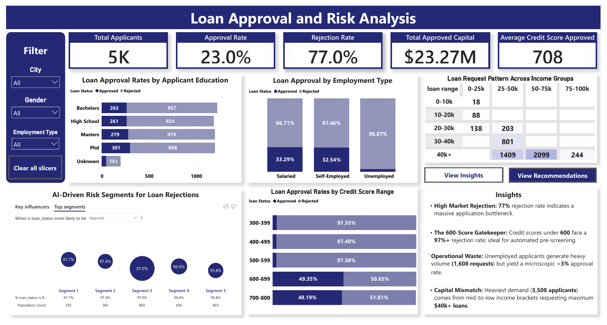
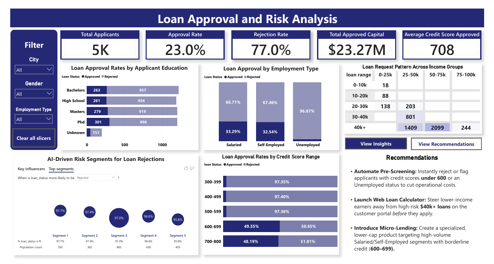

# Loan Risk & Approval Analysis

## Project Overview
This project delivers an end-to-end data analysis solution evaluating a dataset of loan applications. Using **Python** for initial data preparation, **PostgreSQL** for deep-dive analytical querying, and **Power BI** for interactive reporting, this project identifies key factors influencing loan approval rates, segments customer risk profiles, and provides data-driven recommendations for financial institutions to optimize their lending strategies.

## Tech Stack & Tools
* **Data Cleaning & Preprocessing:** Python (Google Colab / Pandas)
* **Database & Analytical Queries:** PostgreSQL
* **Data Visualization & Dashboarding:** Power BI

## Repository Structure
* `/data`: Contains the raw and cleaned loan application datasets.
* `/notebooks`: Python Jupyter notebook used for data cleaning and preprocessing.
* `/scripts`: `loan_analysis.sql` containing 40 comprehensive analytical business queries.
* `/dashboard`: The Power BI `.pbix` file and dashboard screenshots.

---

## Executive Dashboard
 

---

## Key Insights Discovered
* **High-Barrier Gatekeeper (77% Rejection Rate):** The institution faces a massive application bottleneck with an overall rejection rate of 77.0% (only 23.0% approval across 5K applicants). This indicates highly conservative lending criteria or an influx of unqualified leads.

* **The 600-Credit Score Hard Stop:** Applicants with credit scores below 600 are almost universally denied, facing rejection rates exceeding 97% across all sub-600 brackets ($300-399$, $400-499$, and $500-599$). True credit viability only begins when scores cross the 600 benchmark, where approval rates jump drastically to ~49%.

* **Employment Paradox & Operational Waste:** While salaried and self-employed applicants show nearly identical approval distributions (~33% approved vs. ~67% rejected), unemployed individuals generate a staggering volume of 1,608 requests while yielding a microscopic ~3% approval rate. Processing these represents significant operational waste.

* **Education vs. Approvals:** Counterintuitively, higher academic tiers do not yield dramatically higher approval volumes. PhD holders achieved the highest absolute approvals (301), but the volume across Bachelors, High School, and Masters remains tightly clustered between 261 and 279 approvals, suggesting income and credit data heavily outweigh credentialing.

* **Capital Demand Mismatch:** The absolute heaviest loan demand originates from mid-to-low income brackets requesting maximum loan amounts. A cluster of 3,508 applicants making $\$25\text{k}-\$75\text{k}$ are consistently seeking loans exceeding $\$40\text{k}+$, mismatching conservative debt-to-income limits.

---

## SQL Analysis Breakdown (`scripts/loan_analysis.sql`)
The PostgreSQL script features 40 comprehensive business queries divided into three major stages:
1. **Basic Descriptive Metrics:** Aggregations for total applicants, baseline credit scores, and average income benchmarks.
2. **Advanced Business Performance:** Complex conditional logic calculations evaluating approval vs. rejection rates by demographic and risk tiers.
3. **Statistical Outlier Detection:** Implementation of Interquartile Range (IQR) calculations using SQL window functions and percentiles to isolate anomalies in loan amounts and applicant incomes.

## Strategic Recommendations
* **Implement Automated Pre-Screening:**
Since applicants with credit scores below 600 face a 97%+ rejection rate and unemployed individuals yield a microscopic ~3% approval rate, the institution should implement automated pre-screening gatekeepers. Automatically filtering out these high-risk applications before they reach underwriting will eliminate a massive bottleneck and dramatically reduce operational waste.

* **Develop Tailored Loan Products for the "Capital Mismatch":**
The data shows an intense concentration of demand (3,508 applicants) from low-to-mid income brackets ($25\text{k} - $75\text{k}$) requesting maximum tier loans of $40k+. Because these requests likely violate safe debt-to-income limits, the business should design smaller, structured, or collateral-backed loan products specifically capped for these income ranges to safely capture this massive market demand.

* **Optimize the Self-Employed Underwriting Pipeline:**
Salaried and self-employed applicants have almost identical approval distributions (~33% approved / ~67% rejected), showing that employment type itself isn't a negative driver. To safely improve approvals for self-employed individuals, the institution should introduce alternative risk-assessment metrics—such as consistent business cash-flow patterns or professional tenure—rather than relying solely on traditional credit scores.

* **Launch a Credit Builder Product Line:**
With an overall market rejection rate of 77%, the institution is turning away the vast majority of its applicant pool. By introducing a "Credit Builder" or micro-loan program targeted at applicants in the 500–599 credit score tier, the business can nurture high-rejection demographics into qualified future borrowers while generating low-risk, entry-level revenue.
